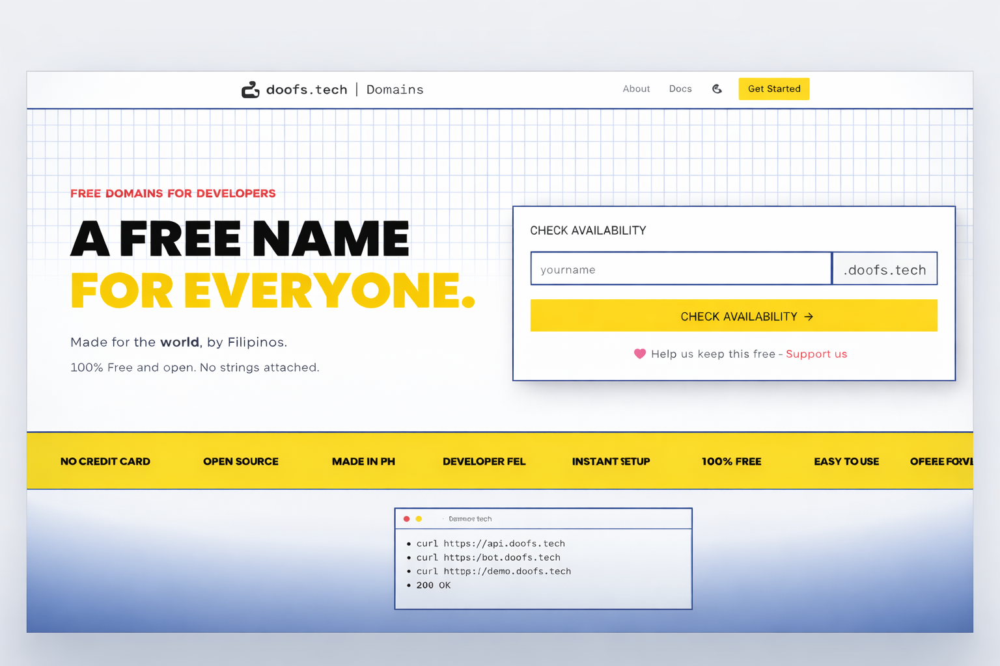

<p align="center">
  <picture>
    <source media="(prefers-color-scheme: dark)" srcset="public/doofs.tech-darkmode-logo.png" />
    <source media="(prefers-color-scheme: light)" srcset="public/doofs.tech-lightmode-logo.png" />
    
  </picture>
</p>

<p align="center">
  
</p>

<h1 align="center">🇵🇭 doofs.tech | Domains</h1>

<p align="center">
  <strong>Free subdomains for Filipino developers and beyond.</strong>
</p>

<p align="center">
  <a href="https://domain.doofs.tech">
    
  </a>
  
</p>

---

## ✨ Features

| Feature | Description |
|---------|-------------|
| 🌐 **Free Subdomains** | Claim your unique subdomain from any available platform domain |
| 🎯 **Multiple Domains** | Choose from a variety of platform domains to suit your project |
| ⚡ **DNS Management** | Full control over A, AAAA, CNAME, TXT, and MX records |
| 🔒 **Secure Auth** | GitHub OAuth with Cloudflare Turnstile protection |
| 📧 **Email Forwarding** | Built-in email forwarding via Mailgun integration |
| 🛠️ **Developer API** | Programmatic access via REST API with API key authentication |
| 📊 **Dashboard** | User-friendly dashboard to manage your domains and DNS records |
| 🔔 **Notifications** | Real-time notifications for domain and DNS changes |
| 📝 **Audit Logs** | Track all changes made to your account and domains |

---

## 🛠️ Tech Stack

<p align="center">
  
  
  
  
  
  
  
  
</p>

---

## 🏗️ Architecture

| Component | Technology | Purpose |
|-----------|------------|---------|
| **Frontend** | React + Vite | SPA with server-side rendering support |
| **Backend** | Convex | Real-time database, queries, mutations, and actions |
| **DNS Provider** | Cloudflare API | DNS record management and propagation |
| **Email** | Mailgun | Transactional emails and forwarding |
| **Auth** | Convex Auth + GitHub OAuth | Secure user authentication |
| **Hosting** | Vercel | Frontend deployment and edge functions |

## 💡 Why use doofs.tech | Domains?

| Problem | Solution |
|---------|----------|
| 🚫 Custom domains are expensive | ✅ Get a **free subdomain** instantly |
| 🕐 DNS setup is complicated | ✅ Simple dashboard to manage DNS records |
| 🔧 No coding knowledge? | ✅ Point-and-click interface, no terminal needed |
| 🏗️ Building multiple projects? | ✅ Claim subdomains for each project easily |
| 🇵🇭 Supporting local? | ✅ Made by Filipino developers, for everyone |

---

## 🔄 How It Works

<table>
<tr>
<td align="center" width="18%">

<h3>🔑</h3>

**Sign In**

Login with GitHub

</td>
<td align="center" width="4%">→</td>
<td align="center" width="18%">

<h3>🎯</h3>

**Pick Domain**

Browse available options

</td>
<td align="center" width="4%">→</td>
<td align="center" width="18%">

<h3>✍️</h3>

**Claim Subdomain**

Reserve your name

</td>
<td align="center" width="4%">→</td>
<td align="center" width="18%">

<h3>⚙️</h3>

**Configure DNS**

Point to your server

</td>
<td align="center" width="4%">→</td>
<td align="center" width="18%">

<h3>🚀</h3>

**Go Live!**

Your site is online

</td>
</tr>
</table>

---

## 📖 How to Use

<details>
<summary><strong>🔐 Step 1: Create an Account</strong></summary>

> Sign in using your **GitHub account** at [domain.doofs.tech](https://domain.doofs.tech).  
> We use GitHub OAuth for secure, passwordless authentication.

</details>

<details>
<summary><strong>🌐 Step 2: Claim Your Subdomain</strong></summary>

> 1. Browse available platform domains  
> 2. Enter your desired subdomain name  
> 3. Click **Claim** — it's yours instantly!

</details>

<details>
<summary><strong>⚙️ Step 3: Configure DNS Records</strong></summary>

> From your dashboard, add any of these record types:
>
> | Type | Purpose | Example |
> |:----:|---------|---------|
> | `A` | Point to IPv4 | `192.168.1.1` |
> | `AAAA` | Point to IPv6 | `2001:db8::1` |
> | `CNAME` | Alias to domain | `myapp.vercel.app` |
> | `TXT` | Verification | `google-site-verification=...` |
> | `MX` | Email routing | `mail.example.com` |

</details>

<details>
<summary><strong>🛠️ Step 4: Use the API (Optional)</strong></summary>

> Generate an API key from your dashboard to automate DNS management:
> ```bash
> curl -X POST https://domain.doofs.tech/api/dns \
>   -H "X-API-Key: your-api-key" \
>   -d '{"type": "A", "name": "@", "content": "1.2.3.4"}'
> ```

</details>

---

## 🔗 Links

- **Live Site**: [domain.doofs.tech](https://domain.doofs.tech)
- **Docs**: [domain.doofs.tech/docs](https://domain.doofs.tech/docs)
- **API Docs**: [domain.doofs.tech/api](https://domain.doofs.tech/api)
- **Tutorials**: [domain.doofs.tech/tutorials](https://domain.doofs.tech/tutorials)


---

<p align="center">
  Made with ❤️ in the <strong>Philippines</strong> 🇵🇭
</p>

<p align="center">
  <sub>© 2026 doofs.tech. All rights reserved.</sub>
</p>
